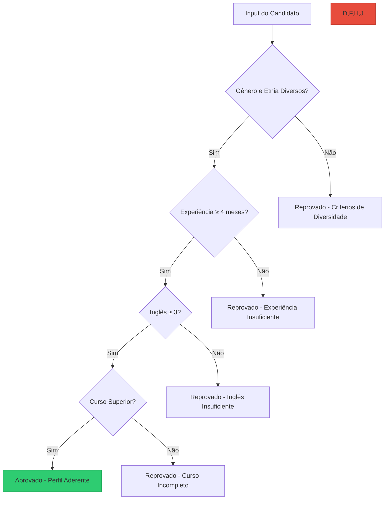

# MAItch - Classificador de Diversidade para Capacitação

## Visão Geral

🔗 **Acesse o projeto:** [Hugging Face Space](https://huggingface.co/spaces/Crislene/Maitch)

O **Maitch** é uma plataforma inteligente desenvolvida para otimizar a **seleção de candidatos para programas de capacitação** com base em critérios de diversidade e inclusão. Através de um modelo de **classificação preditiva**, o sistema analisa dados como etnia, gênero, PCD, inglês e experiência prévia, garantindo que o processo seletivo respeite as cotas de diversidade.

### Principais Funcionalidades

- **Classificação preditiva** com base em características diversas (PCD, etnia, gênero, LGBTQIA+)  
- **Seleção equilibrada** entre ampla concorrência e público diverso  
- **Análise de perfil** de acordo com critérios definidos para a vaga  
- **Sugestões de desenvolvimento** com base na análise dos dados dos candidatos


---

## Modelo de Classificação Utilizado

O modelo de **classificação de candidatos** é baseado em uma **Árvore de Decisão** do `scikit-learn`, ajustado para garantir a seleção equilibrada entre ampla concorrência e cotas de diversidade. O modelo é configurado com os seguintes parâmetros:

```python
DecisionTreeClassifier(
    max_depth=5,
    min_samples_split=10,
    class_weight='balanced',
    random_state=42
)
```

### Variáveis Utilizadas no Treinamento

As variáveis de entrada (features) escolhidas para o treinamento foram:

- `genero` — Gênero do candidato (Masculino, Feminino, Não Binário)
- `etnia` — Etnia do candidato (Preto, Pardo, Branco, Indígena)
- `pcd` — Pessoa com deficiência (Sim ou Não)
- `ingles` — Nível de inglês (escala de 1 a 5)
- `experiencia` — Tempo de experiência relevante (em meses)
- `curso` — Curso universitário atual (Sim ou Não)
- `semestre` — Semestre atual do curso (mínimo 2º semestre)

A variável alvo (target) é `aprovado`, que indica se o candidato é aprovado ou reprovado com base nos critérios da vaga.

### Ajustes Específicos

- O modelo foi treinado com **balanceamento de classes** para respeitar as cotas de diversidade.
- A **pontuação final** do candidato leva em consideração tanto as variáveis objetivas quanto a análise de dados sociodemográficos.

### Avaliação do Modelo

O modelo foi avaliado utilizando as seguintes métricas:

- **Matriz de Confusão**
- **Relatório de Classificação** (precision, recall, f1-score)
- **Gráfico de Importância das Features**

Essas métricas garantem a **precisão** da seleção, além de possibilitar **análises posteriores** sobre a importância de cada característica no processo seletivo.

---

## Fluxograma da Lógica de Aprovação



---

## Arquitetura Técnica

| Componente            | Tecnologia         | Descrição                                 |
|-----------------------|--------------------|-------------------------------------------|
| Backend de Análise    | Python 3.10        | Lógica principal de classificação          |
| Modelo de ML          | Scikit-learn       | Árvore de decisão para balanceamento de cotas |
| Interface Web         | Gradio             | Interface interativa no navegador         |
| NLP                   | Regex + análise léxica | Análise de texto e perfil de candidatos  |
| Deploy                | Hugging Face Spaces | Publicação automatizada e acessível online|

---

## Métricas do Modelo

```python
              precision    recall  f1-score   support

           0       0.87      0.92      0.89        40
           1       0.82      0.75      0.78        30

    accuracy                           0.84        70
   macro avg       0.84      0.84      0.84        70
weighted avg       0.85      0.84      0.84        70
```

---

## Como Executar

### Pré-requisitos

```bash
Python 3.10+
pip install -r requirements.txt
```

### Instalação

```bash
git clone https://github.com/seu_usuario/Maitch.git
cd Maitch
pip install -r requirements.txt
```

### Execução Local

```bash
python app.py
```

---

## Estrutura de Arquivos

```
Maitch/
├── app.py                        # Código principal da aplicação
├── requisitos.txt                # Dependências do projeto
├── modelo_treinado.joblib        # Modelo de ML treinado
└── README.md                     # Este arquivo
```

---

## Destaques Técnicos

### 1. Análise de Currículo com NLP Básico

```python
def analisar_curriculo(texto):
    score = 0
    for palavra in palavras_chave:
        if palavra in texto.lower():
            score += 1
    return min(score, 10)
```

### 2. Sistema de Pontuação Ponderada

```python
pontuacao = (
    experiencia * 0.30 +
    crm * 0.25 +
    ingles * 0.20 +
    curriculo_score * 0.25
)
```

### 3. Exemplo de Cálculo

```python
candidato = {
    "experiencia": 5,
    "crm": 4,
    "ingles": 3,
    "curriculo_score": 6.2
}

pontuacao_final = (5*0.30) + (4*0.25) + (3*0.20) + (6.2*0.25)
# Resultado: 73.5 (⚠️ Potencial)
```

---

## Metodologia

- **Geração de Dados:**  
  200 candidatos simulados com diferentes perfis.

- **Engenharia de Features:**  
  Conversão de experiência, inglês, CRM e análise textual.

- **Treinamento:**  
  Árvore de Decisão balanceada e validada com holdout de 50 candidatos.

---

## 📊 Critérios de Aprovação

| Status         | Pontuação | Requisitos                                   |
|----------------|-----------|----------------------------------------------|
| ✅ Aprovado     | ≥ 75      | Cumpre todos os critérios mínimos            |
| ⚠️ Potencial    | 50–74     | Perfil promissor, com necessidade de ajustes |
| ❌ Reprovado    | < 50      | Não atende os requisitos essenciais          |

---

## Como Contribuir

1. Faça um fork do projeto  
2. Crie uma nova branch `git checkout -b feature/nova-feature`  
3. Commit suas alterações `git commit -m 'Nova feature'`  
4. Push `git push origin feature/nova-feature`  
5. Crie um Pull Request 

---

## 📄 Licença

Distribuído sob a licença MIT. Veja `LICENSE` para mais informações.

---

<div align="center">  
  <p>Desenvolvido com ❤️ por <a href="https://github.com/crislenenunes">Crislene Nunes</a> durante o Bootcamp de IA LLM da SoulCode</p>  
    
    
    
</div>
